# AWS Highly Available Web Application

## High Availability, Load Balancing, Auto Scaling & Self-Healing Infrastructure

**Author:** Padmore Nana Prempeh

**Technologies**

- Amazon EC2
- Application Load Balancer
- Auto Scaling Groups
- Launch Templates
- Amazon Machine Images (AMI)
- Target Groups
- CloudWatch
- Security Groups
- SSH
- Apache HTTP Server


---

# Table of Contents

- Abstract
- Introduction
- Objectives
- Architecture
- Implementation
- Testing
- Results
- Lessons Learned
- Cost Considerations
- Future Improvements
- Conclusion

---

# Abstract

This project demonstrates the design and deployment of a highly available web application on Amazon Web Services. The system uses Amazon EC2 instances, a custom Amazon Machine Image, an Application Load Balancer, Target Groups, Launch Templates, Auto Scaling Groups, and Amazon CloudWatch to provide fault tolerance, automatic recovery, and dynamic scaling.

The project began with a single EC2 instance hosting a static portfolio website through Apache. The configured instance was converted into a custom AMI, which was then used to launch additional identical servers. An Application Load Balancer was configured to distribute HTTP traffic across healthy EC2 instances. An Auto Scaling Group was then created to maintain the desired number of servers and automatically replace unhealthy instances.

The infrastructure was tested by manually stopping an EC2 instance and by generating CPU load to trigger dynamic scaling. The system successfully replaced unhealthy instances and scaled out from two instances to four instances based on CPU utilization.

---

# 1. Introduction

Cloud applications must remain available even when individual servers fail or traffic increases unexpectedly. Traditional single-server deployments create a single point of failure because the application becomes unavailable if that server stops working.

This project solves that problem by designing a highly available AWS architecture. Instead of relying on one EC2 instance, the application is deployed behind an Application Load Balancer and managed by an Auto Scaling Group. This allows AWS to distribute traffic, monitor health checks, replace failed instances, and scale capacity based on demand.

---

# 2. Project Objectives

The main objectives of this project were to:

* Deploy a static portfolio website on Amazon EC2.
* Configure Apache as the web server.
* Create a custom Amazon Machine Image from the configured instance.
* Launch additional EC2 instances from the AMI.
* Configure an Application Load Balancer.
* Register instances in a Target Group.
* Create a Launch Template.
* Configure an Auto Scaling Group.
* Enable dynamic scaling based on CPU utilization.
* Test automatic recovery after instance failure.
* Document the full deployment process professionally.

---

# 3. High-Level Architecture

```text
                    Internet
                        |
                        v
            Application Load Balancer
                        |
                  Target Group
             /                    \
            v                      v
      EC2 Instance A          EC2 Instance B
            \                      /
             \                    /
              Auto Scaling Group
                        |
                Launch Template
                        |
                  Custom AMI
                        |
                 Amazon CloudWatch
```

The Application Load Balancer distributes incoming HTTP requests to healthy EC2 instances. The Auto Scaling Group maintains the desired capacity and automatically replaces unhealthy instances. CloudWatch monitors CPU utilization and triggers scaling actions when the configured threshold is exceeded.

---

# 4. Implementation

## 4.1 Launching the Initial EC2 Instance

The deployment began by launching an Amazon EC2 instance using Amazon Linux 2023. The instance served as the first web server for the portfolio application.

### Commands Used

No terminal commands were required during this step because the EC2 instance was launched using the AWS Management Console.

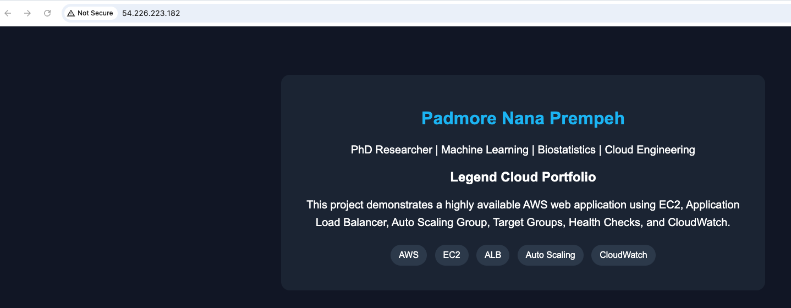

**Figure 1. Launching the initial EC2 instance.**

---

## 4.2 Configuring the Web Server

After the EC2 instance was running, Apache HTTP Server was installed and started. The portfolio website was then deployed to Apache's document root.

### Commands Used

```bash
sudo yum update -y

sudo yum install httpd -y

sudo systemctl start httpd

sudo systemctl enable httpd

sudo systemctl status httpd
```

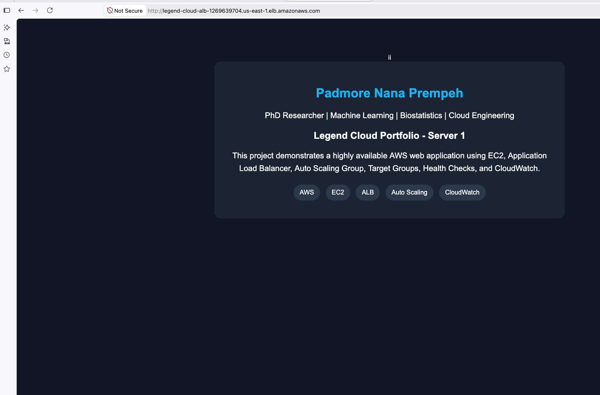

**Figure 2. Web server successfully running.**

---

## 4.3 Configuring Security Group Rules

The security group was configured to allow SSH access for administration and HTTP access for public web traffic.

### Configuration

The following inbound rules were configured using the AWS Console:

- HTTP (80) → 0.0.0.0/0
- SSH (22) → My IP

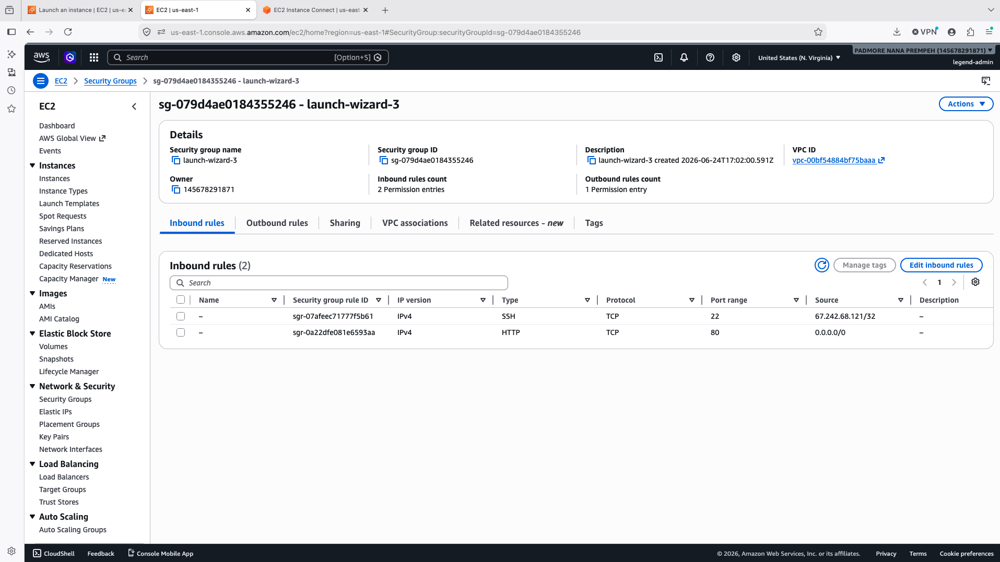

**Figure 3. Security group inbound rules.**

---

## 4.4 Creating a Custom AMI

After configuring the server, a custom Amazon Machine Image was created. This AMI captured the server configuration, installed packages, and website files.

### Action Performed

A custom Amazon Machine Image (AMI) was created from the configured EC2 instance through the AWS Management Console.

This image preserves:

- Installed Apache web server
- Website files
- Operating system configuration
- Security updates

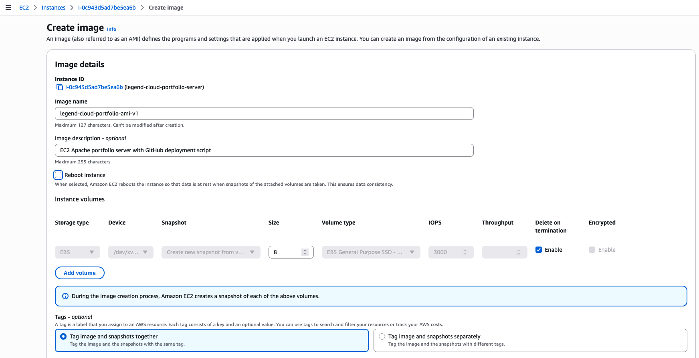

**Figure 4. Creating a custom AMI.**

---

## 4.5 Verifying the Custom AMI

The custom AMI was successfully created and became available for launching new EC2 instances.

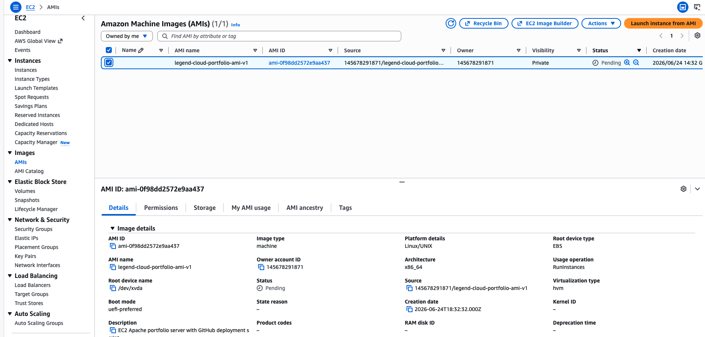

**Figure 5. Custom AMI successfully created.**

---

## 4.6 Launching a Second Instance from the AMI

A second EC2 instance was launched from the custom AMI to confirm that the image could reproduce the configured web server.

### Deployment Method

A second EC2 instance was launched directly from the custom AMI to verify that the application configuration could be reproduced without repeating the installation process.

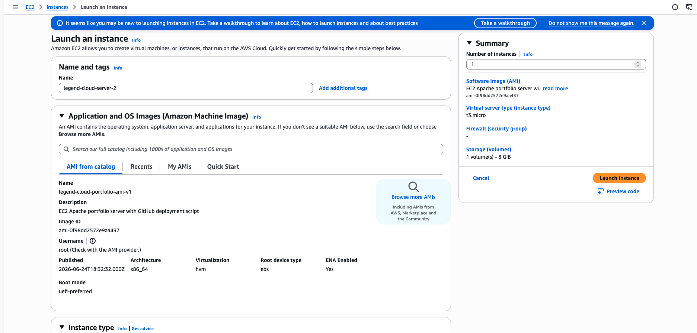

**Figure 6. Launching a new instance from the custom AMI.**

---

## 4.7 Verifying the Second Server

The second server launched successfully and served the same portfolio website.

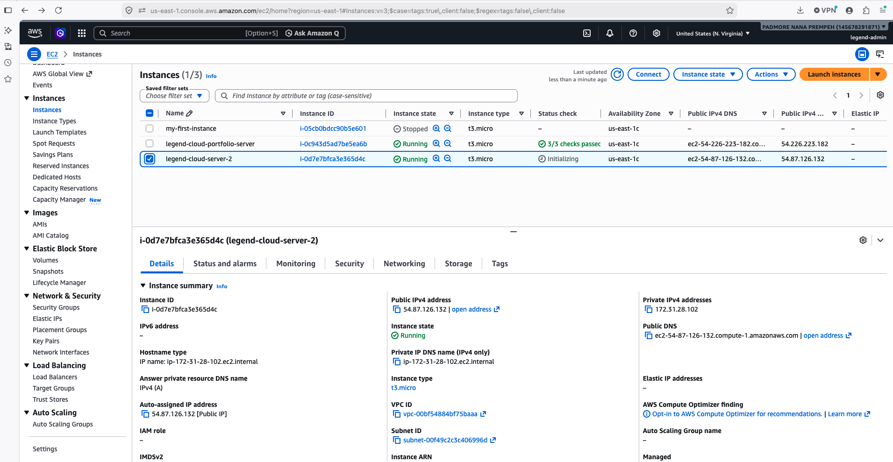

**Figure 7. Second web server running successfully.**

---

## 4.8 Creating the Target Group

A Target Group was created to group the EC2 instances that would receive traffic from the Application Load Balancer.

### Configuration

Target Type:
- Instance

Protocol:
- HTTP

Port:
- 80

Health Check Path:
- /

Health Check Protocol:
- HTTP


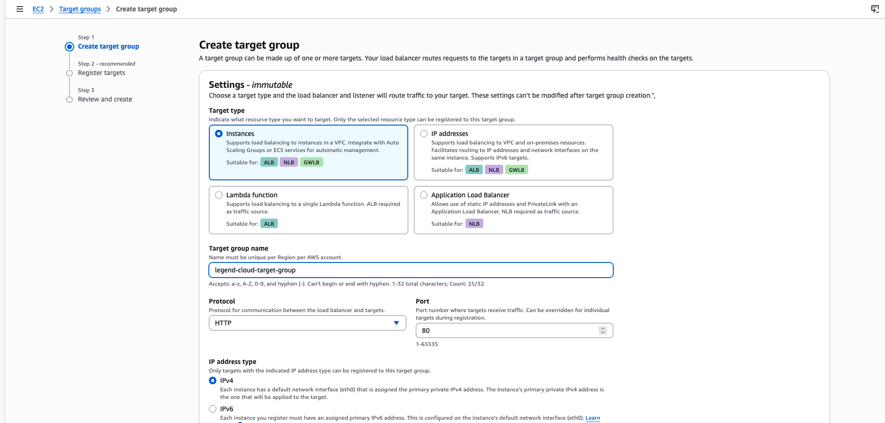

**Figure 8. Creating the target group.**

---

## 4.9 Verifying Target Health

Both EC2 instances passed health checks and were marked healthy by the Target Group.

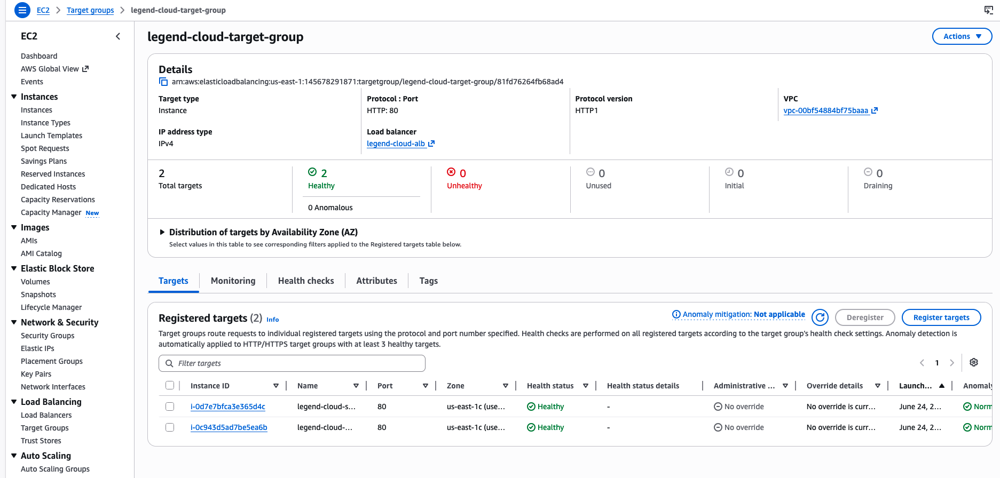

**Figure 9. Target Group health verification.**

---

## 4.10 Creating the Application Load Balancer

An internet-facing Application Load Balancer was created to distribute HTTP traffic across the healthy EC2 instances.

### Configuration

The Application Load Balancer was configured to:

- Listen on Port 80
- Forward traffic to the Target Group
- Perform automatic health checks
- Distribute requests across healthy EC2 instances


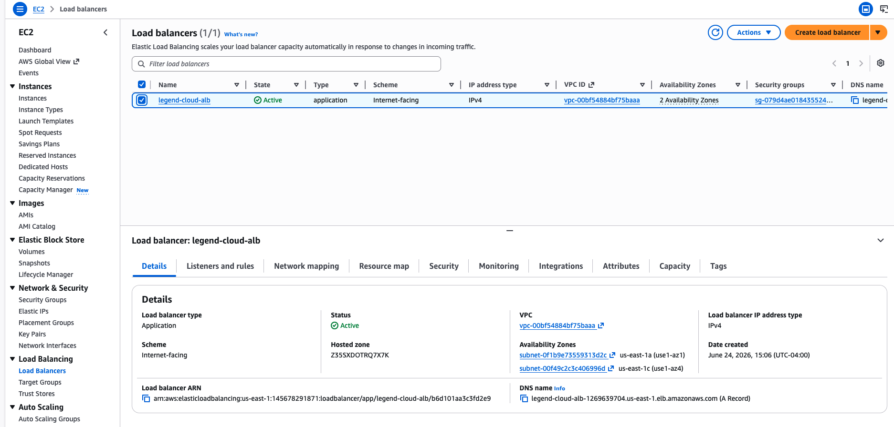

**Figure 10. Application Load Balancer configuration.**

---

## 4.11 Creating the Launch Template

A Launch Template was created using the custom AMI, instance type, key pair, and security group. This template allows Auto Scaling to launch identical EC2 instances automatically.

### Launch Template Settings

- AMI: Custom AMI
- Instance Type: t3.micro
- Security Group: Web Server Security Group
- Key Pair: Existing SSH Key


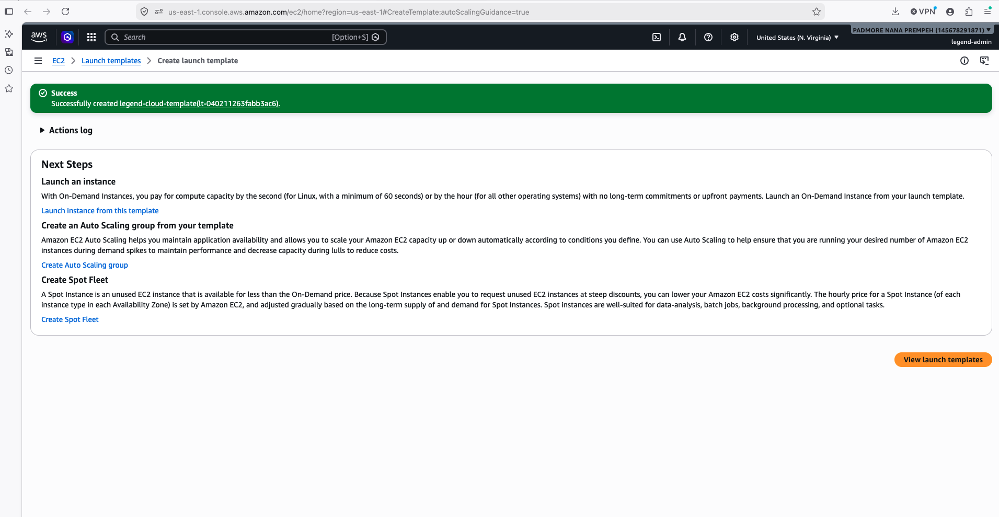

**Figure 11. Launch template created.**

---

## 4.12 Reviewing the Auto Scaling Group

The Auto Scaling Group configuration was reviewed before creation. The group was configured to launch instances across multiple Availability Zones.

### Auto Scaling Configuration

Desired Capacity: 2

Minimum Capacity: 2

Maximum Capacity: 4

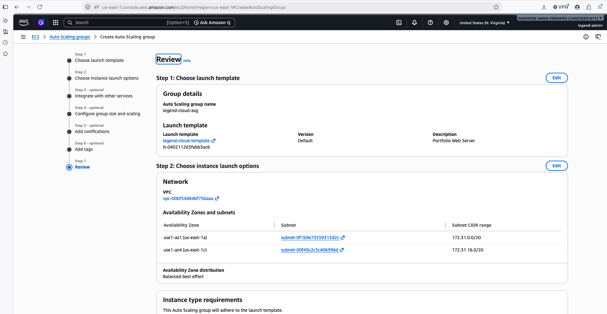

**Figure 12. Auto Scaling Group review.**

---

## 4.13 Configuring Dynamic Scaling

A target tracking scaling policy was created using average CPU utilization. The target value was set to 50 percent.

### CPU Stress Test

The following command was executed on one EC2 instance to generate CPU load and trigger Auto Scaling.

```bash
sudo yum install stress -y

stress --cpu 4 --timeout 300
```


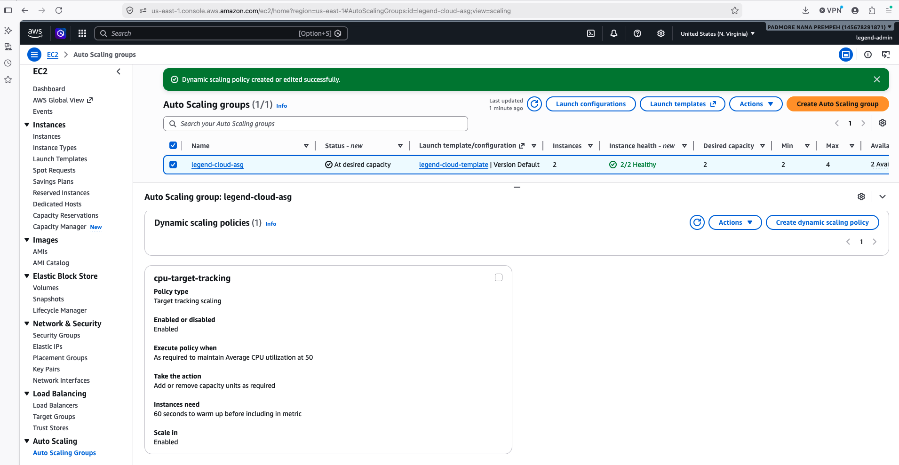

**Figure 13. Dynamic scaling policy configuration.**

---

## 4.14 Verifying Auto Scaling Instances

The Auto Scaling Group launched and managed EC2 instances using the Launch Template.

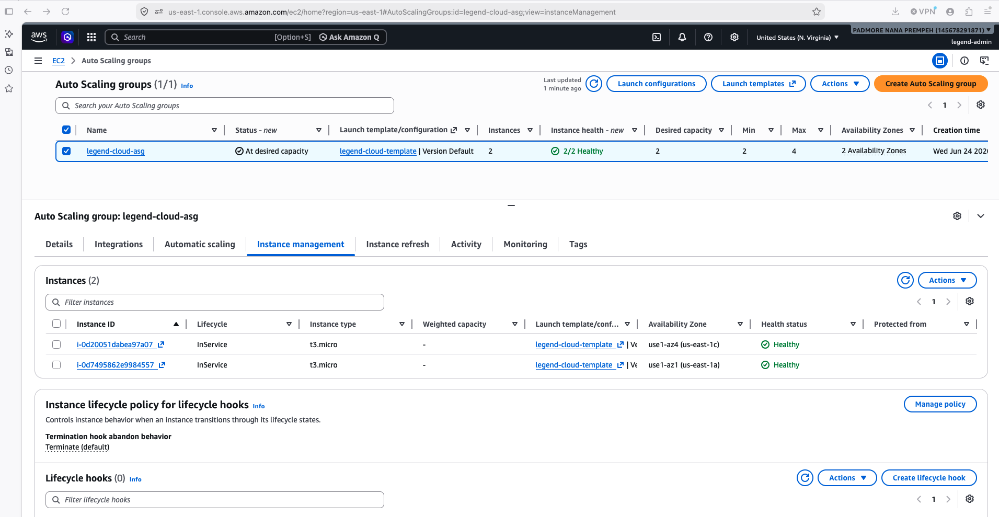

**Figure 14. Instances managed by Auto Scaling.**

---

## 4.15 Auto Scaling Group Created

The Auto Scaling Group reached its desired capacity and maintained healthy instances across Availability Zones.

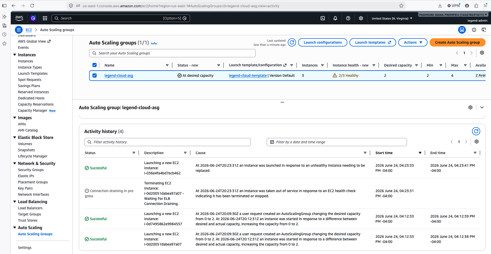

**Figure 15. Auto Scaling Group successfully created.**

---

# 5. Testing and Validation

## 5.1 Auto-Healing Test

One EC2 instance was intentionally stopped to simulate a server failure. The Auto Scaling Group detected the unhealthy instance and began the replacement process.

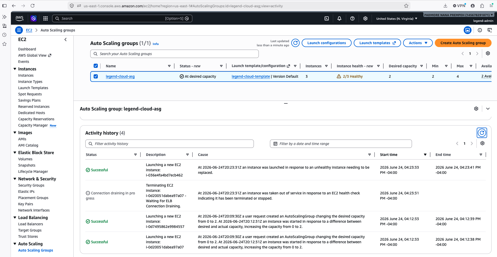

**Figure 16. Auto-healing instance replacement process.**

---

## 5.2 Scale-Out Test

CPU load was generated using the Linux command:

```bash
yes > /dev/null
```

This caused CPU utilization to increase, triggering the dynamic scaling policy.

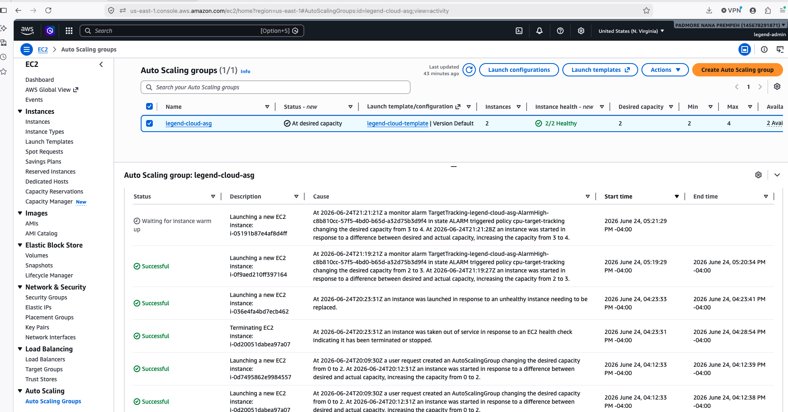

**Figure 17. Scale-out event triggered by high CPU utilization.**

---

## 5.3 Auto Scaling Activity History

The Auto Scaling activity history confirmed that AWS launched additional instances in response to increased CPU utilization.

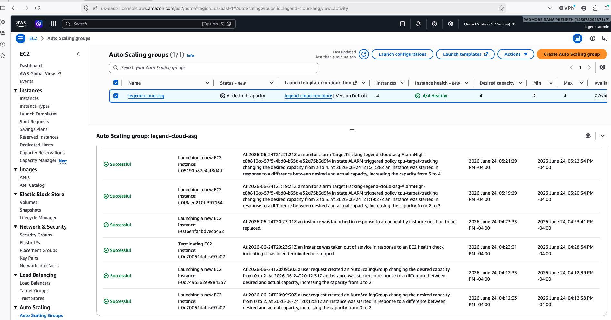

**Figure 18. Auto Scaling scale-out activity history.**

---

## 5.4 Load Balancer Verification: Server 1

The Application Load Balancer routed traffic to Server 1.

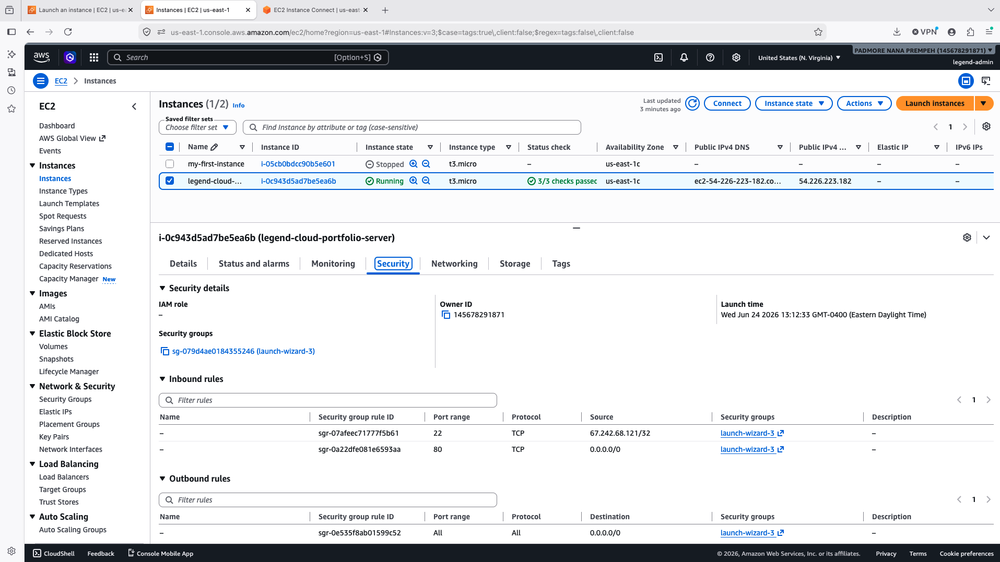

**Figure 19. Load Balancer routing request to Server 1.**

---

## 5.5 Load Balancer Verification: Server 2

The Application Load Balancer also routed traffic to Server 2, proving traffic distribution across multiple backend instances.


**Figure 20. Load Balancer routing request to Server 2.**

---

## 5.6 Target Group Creation Confirmation

The Target Group was successfully created and associated with the infrastructure.


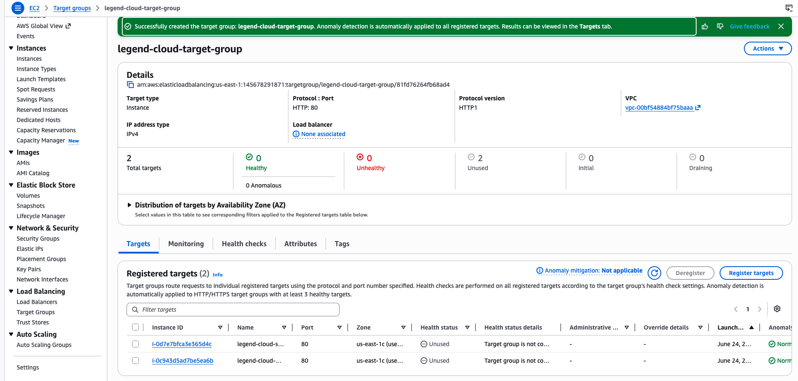

**Figure 21. Target Group successfully created.**

---

## 5.7 Desired Capacity Launch

The Auto Scaling Group launched the desired number of instances automatically.

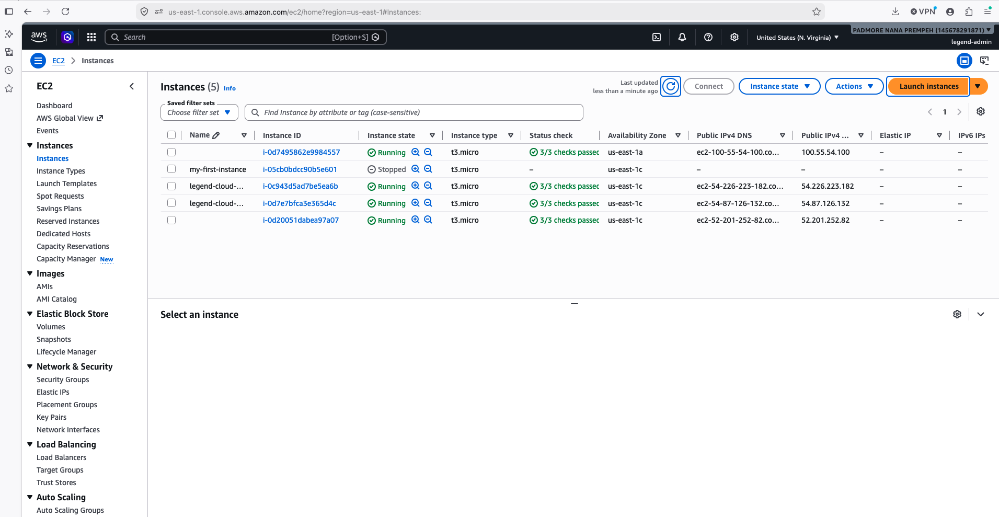

**Figure 22. Auto Scaling Group launching desired capacity.**

---

## 5.8 Manual Failure Simulation

An EC2 instance was manually stopped to test fault tolerance.

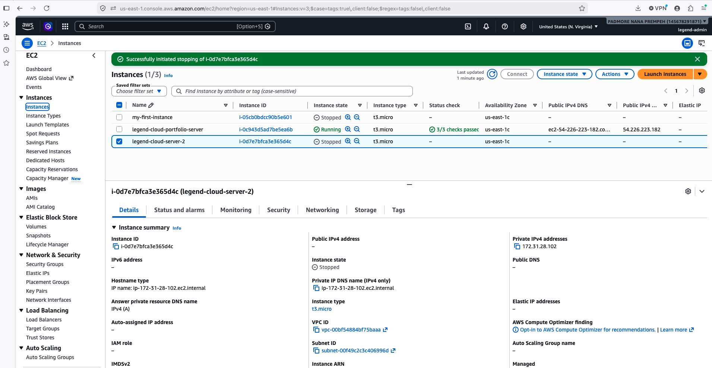

**Figure 23. EC2 instance manually stopped.**

---

## 5.9 Target Group Detects Stopped Instance

The Target Group detected that the stopped instance was unavailable and removed it from active service.

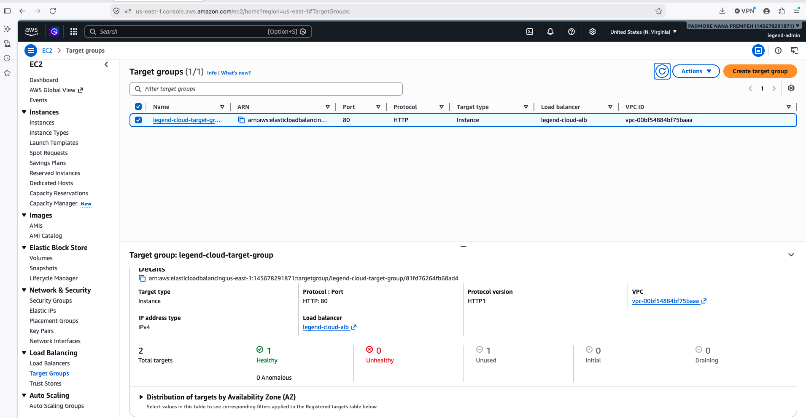

**Figure 24. Target Group detecting stopped instance.**

---

## 5.10 Auto Scaling Replaces the Unhealthy Instance

The Auto Scaling Group replaced the unhealthy instance using the Launch Template.

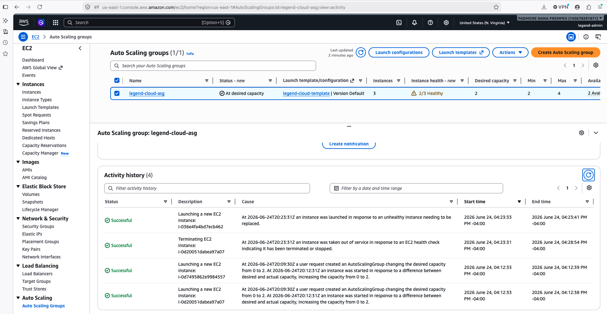

**Figure 25. Auto Scaling replacing unhealthy instance.**

---

## 5.11 Replacement Instance Running

The replacement instance launched successfully and passed health checks.

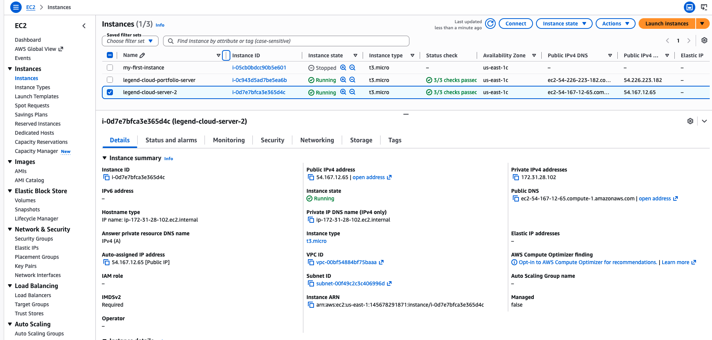

**Figure 26. Replacement instance running successfully.**

---

## 5.12 Website Deployment Using SSH and CLI

### Commands Used

The website was deployed manually using SSH.

```bash
scp -i legend-key.pem index.html ec2-user@<PUBLIC-IP>:~

ssh -i legend-key.pem ec2-user@<PUBLIC-IP>

sudo cp index.html /var/www/html/

ls /var/www/html
```

The web server immediately served the updated page after copying the HTML file into the Apache document root.

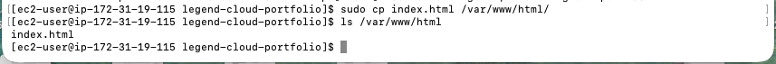

**Figure 27. Deploying website files using SSH and CLI.**

---

# 6. Results

The infrastructure was successfully deployed and tested. The Application Load Balancer distributed traffic across multiple EC2 instances, and the Target Group ensured that only healthy instances received requests.

The Auto Scaling Group successfully maintained desired capacity. When an EC2 instance was manually stopped, AWS detected the unhealthy instance and automatically launched a replacement. This confirmed that the architecture provided self-healing capability.

Dynamic scaling was also validated by generating CPU load. CloudWatch detected the increased CPU utilization and triggered Auto Scaling to increase capacity from two instances to four instances.

---

# 7. Lessons Learned

This project provided hands-on experience with:

* EC2 provisioning and remote SSH access.
* Apache web server configuration.
* Security Group rules.
* Custom AMI creation.
* Launch Templates.
* Application Load Balancers.
* Target Groups and health checks.
* Auto Scaling Groups.
* CloudWatch target tracking policies.
* Self-healing infrastructure.
* Dynamic scaling based on CPU utilization.

---

# 8. Cost Considerations

To avoid unnecessary AWS charges, resources should be deleted after completing the project. Important resources to clean up include:

* Auto Scaling Group.
* Application Load Balancer.
* Target Group.
* EC2 instances.
* Launch Template.
* Custom AMI.
* EBS snapshots.
* CloudWatch alarms.
* Unused security groups.

---

# 9. Future Improvements

Future improvements may include:

* Adding HTTPS using AWS Certificate Manager.
* Using Route 53 for a custom domain.
* Adding CloudFront for content delivery.
* Rebuilding the infrastructure using Terraform.
* Adding GitHub Actions for CI/CD.
* Containerizing the application with Docker.
* Deploying the application using ECS or EKS.

---

# 10. Conclusion

This project successfully demonstrates the design and implementation of a production-inspired AWS infrastructure using EC2, Application Load Balancer, Target Groups, Launch Templates, Auto Scaling Groups, and CloudWatch. By simulating instance failures and CPU-based scaling events, the infrastructure validated both high availability and self-healing capabilities. This project reflects practical cloud engineering skills aligned with AWS Solutions Architect and DevOps best practices.
