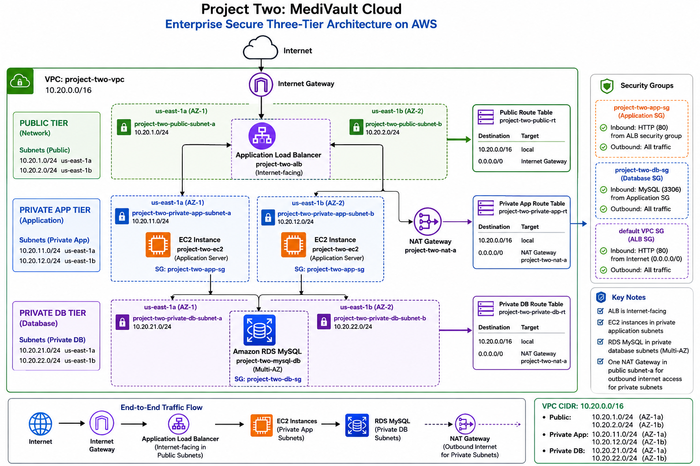

# MediVault Cloud: Secure Three-Tier AWS Architecture


1

## Project Overview

**MediVault Cloud** is a secure three-tier web application architecture deployed on Amazon Web Services (AWS).

The project demonstrates how to design, deploy, secure, and validate a cloud environment that separates public-facing infrastructure, application workloads, and database resources into distinct network tiers.

The architecture was built inside a custom Amazon VPC spanning two Availability Zones in the `us-east-1` Region. An internet-facing Application Load Balancer receives public HTTP traffic and forwards requests to an EC2 application server located in a private subnet. The application tier communicates with an Amazon RDS for MySQL database deployed in private database subnets.

The EC2 instance has no direct public exposure. Outbound internet access from the private application tier is provided through a NAT Gateway, while security groups enforce communication between the web, application, and database layers.

The completed deployment was validated end to end by:

- accessing the application through the Application Load Balancer DNS endpoint;
- confirming the EC2 instance passed Application Load Balancer health checks;
- connecting from the private EC2 instance to the private RDS endpoint on TCP port `3306`;
- authenticating successfully to MySQL;
- creating a database and application table;
- inserting application records; and
- querying the stored records successfully.

---

## Architecture Diagram



The architecture follows a three-tier design:

1. **Public tier** for internet ingress and load balancing
2. **Private application tier** for the EC2 application workload
3. **Private database tier** for Amazon RDS MySQL

---

## Business Scenario

MediVault represents a cloud-hosted application that requires controlled access to sensitive application data.

The design requirements were:

- users must access the application from the internet;
- the application server must not be directly exposed to the internet;
- the database must remain private;
- public traffic must enter through a managed load balancer;
- the application tier must be able to reach the database;
- the database must accept connections only from the application tier;
- private application resources must have controlled outbound internet access;
- the network must span multiple Availability Zones; and
- every major stage of the deployment must be validated and documented.

This project focuses on the cloud infrastructure and connectivity pattern behind such an application.

---

## Architecture Summary

```text
Internet
   |
   v
Internet Gateway
   |
   v
Application Load Balancer
(Public Subnets A and B)
   |
   v
EC2 Application Server
(Private Application Subnet)
   |
   v
Amazon RDS MySQL
(Private Database Subnets)
```
---
The private application tier also has a separate outbound path:

```
Private Application Subnets
          |
          v
Private Application Route Table
          |
          v
NAT Gateway
(Public Subnet A)
          |
          v
Internet Gateway
          |
          v
Internet
```
The NAT Gateway is used for outbound connections initiated by resources in the private application tier. It is not part of the inbound user request path.

## AWS Services Used

| AWS Service                 | Purpose                                                           |
| --------------------------- | ----------------------------------------------------------------- |
| Amazon VPC                  | Provides the isolated network environment                         |
| Public Subnets              | Host internet-facing infrastructure                               |
| Private Application Subnets | Isolate application workloads from direct internet access         |
| Private Database Subnets    | Isolate the database tier                                         |
| Internet Gateway            | Connects the VPC public tier to the internet                      |
| NAT Gateway                 | Provides outbound internet access for private application subnets |
| Elastic IP                  | Provides the public address used by the NAT Gateway               |
| Route Tables                | Control traffic paths between network tiers                       |
| Security Groups             | Enforce stateful access rules between resources                   |
| Application Load Balancer   | Receives and distributes HTTP application traffic                 |
| Target Group                | Connects the ALB listener to the EC2 application target           |
| Amazon EC2                  | Hosts the application server                                      |
| Amazon RDS for MySQL        | Provides the managed relational database                          |
| DB Subnet Group             | Places RDS across private database subnets                        |
| Amazon Linux 2023           | Operating system used by the EC2 instance                         |


## Network Design
### VPC

| Resource           | Value                      |
| ------------------ | -------------------------- |
| Name               | `project-two-vpc`          |
| CIDR Block         | `10.20.0.0/16`             |
| Region             | `us-east-1`                |
| Availability Zones | `us-east-1a`, `us-east-1b` |

The /16 VPC CIDR provides a large private address space while allowing the environment to be divided into clearly separated subnet tiers.

### Subnet Plan
| Tier        | Subnet                             | CIDR            | Availability Zone |
| ----------- | ---------------------------------- | --------------- | ----------------- |
| Public      | `project-two-public-subnet-a`      | `10.20.1.0/24`  | `us-east-1a`      |
| Public      | `project-two-public-subnet-b`      | `10.20.2.0/24`  | `us-east-1b`      |
| Private App | `project-two-private-app-subnet-a` | `10.20.11.0/24` | `us-east-1a`      |
| Private App | `project-two-private-app-subnet-b` | `10.20.12.0/24` | `us-east-1b`      |
| Private DB  | `project-two-private-db-subnet-a`  | `10.20.21.0/24` | `us-east-1a`      |
| Private DB  | `project-two-private-db-subnet-b`  | `10.20.22.0/24` | `us-east-1b`      |

The address plan makes each architectural tier immediately identifiable:
```
10.20.1.x  - Public Subnet A
10.20.2.x  - Public Subnet B

10.20.11.x - Private Application Subnet A
10.20.12.x - Private Application Subnet B

10.20.21.x - Private Database Subnet A
10.20.22.x - Private Database Subnet B
```

## Routing Design
### Public Tier

The public subnets are associated with a public route table containing a default route to the Internet Gateway.
```
Destination       Target
10.20.0.0/16      local
0.0.0.0/0         Internet Gateway
```

This allows internet-facing resources such as the Application Load Balancer and NAT Gateway to communicate through the VPC Internet Gateway.

### Private Application Tier
The private application subnets are associated with a private application route table.

```
Destination       Target
10.20.0.0/16      local
0.0.0.0/0         NAT Gateway
```

The EC2 application server does not require a public IP address.

When the private application tier needs outbound internet access, traffic follows this path:
```
EC2
 |
 v
Private Application Route Table
 |
 v
NAT Gateway
 |
 v
Internet Gateway
 |
 v
Internet
```

Inbound internet connections cannot use the NAT Gateway to initiate connections directly to the EC2 instance.

### Private Database Tier
The database tier uses dedicated private subnets.

Application-to-database communication remains inside the VPC using private addressing:
```
EC2 Application Tier
        |
        | TCP 3306
        v
Amazon RDS MySQL
```
The RDS database is not intended to accept direct connections from the public internet.

## Application Load Balancer
The project uses an internet-facing Application Load Balancer.
| Setting            | Value                      |
| ------------------ | -------------------------- |
| Name               | `project-two-alb`          |
| Type               | Application Load Balancer  |
| Scheme             | Internet-facing            |
| IP Address Type    | IPv4                       |
| Listener           | HTTP                       |
| Listener Port      | `80`                       |
| Availability Zones | `us-east-1a`, `us-east-1b` |


The ALB is deployed across both public subnets:
```
project-two-public-subnet-a
10.20.1.0/24
us-east-1a

project-two-public-subnet-b
10.20.2.0/24
us-east-1b
```
Incoming traffic follows this path:

```
User
 |
 v
Internet
 |
 v
Internet Gateway
 |
 v
Application Load Balancer
 |
 v
Target Group
 |
 v
EC2 Application Server
```

## Target Group

The Application Load Balancer forwards traffic to:
```
Target Group: project-two-app-tg
Protocol: HTTP
Port: 80
Target Type: Instance
Health Check Protocol: HTTP
Health Check Path: /
```
The EC2 application instance was registered as a target and successfully passed the load balancer health checks.

A healthy target confirms that:
```

the ALB can reach the EC2 instance;
the application security group allows the required traffic;
the web service is listening on port 80; and
the health check endpoint returns a successful response.
```
## EC2 Application Tier
| Setting                          | Value                    |
| -------------------------------- | ------------------------ |
| Instance Name                    | `project-two-ec2`        |
| Operating System                 | Amazon Linux 2023        |
| Network Tier                     | Private Application Tier |
| Application Port                 | `80`                     |
| Direct Public Application Access | No                       |
| Database Connectivity            | MySQL on port `3306`     |
The application server is not used as the public entry point to the system.

Users access the application through:
```
Application Load Balancer
        |
        v
EC2 Application Server
```
This prevents the application server from being directly exposed as the primary public endpoint.

## Amazon RDS MySQL Database Tier

| Setting               | Value                  |
| --------------------- | ---------------------- |
| DB Instance           | `project-two-mysql-db` |
| Engine                | MySQL                  |
| Network Tier          | Private Database Tier  |
| Database Port         | `3306`                 |
| Database Name Created | `project_two_db`       |
| Application Table     | `app_users`            |

The RDS deployment uses the two private database subnets:
```
project-two-private-db-subnet-a
10.20.21.0/24
us-east-1a

project-two-private-db-subnet-b
10.20.22.0/24
us-east-1b
```

The database is reachable from the application tier through the private VPC network.

## Security Design
The project uses security-group relationships to control traffic between tiers.

The intended security chain is:
```
Internet
   |
   | HTTP 80
   v
ALB Security Group
   |
   | HTTP 80
   v
Application Security Group
   |
   | MySQL 3306
   v
Database Security Group
```

### ALB Layer
The load balancer accepts public HTTP traffic.
```
Inbound:
HTTP / TCP 80
Source: 0.0.0.0/0
```
The ALB is the public application entry point.

### Application Layer
The application security group allows application traffic from the load balancer layer.
```
Inbound:
HTTP / TCP 80
Source: ALB security group
```
This security-group reference is stronger than allowing port 80 from the entire internet because the EC2 application server accepts application traffic only through the load balancer.

### Database Layer
The RDS security group allows MySQL traffic from the application security group.

```
Inbound:
MySQL / TCP 3306
Source: Application security group
```
This creates a security-group chain:
```
Internet
   |
   v
ALB
   |
   v
EC2
   |
   v
RDS MySQL
```
Each tier accepts only the traffic required from the tier directly above it.

## End-to-End Traffic Flow
### Inbound Application Request

1. A user sends an HTTP request.

2. The request reaches the VPC through the Internet Gateway.

3. The Application Load Balancer receives the request
   across the public subnet layer.

4. The ALB listener evaluates the request.

5. The request is forwarded to project-two-app-tg.

6. The target group sends the request to project-two-ec2
   on TCP port 80.

7. The EC2 application server processes the request.

8. If application data is required, EC2 connects to
   Amazon RDS MySQL on TCP port 3306.

9. The response returns through the application path.

### Outbound Private Application Traffic

1. EC2 initiates an outbound request.

2. The private application route table matches 0.0.0.0/0.

3. Traffic is forwarded to project-two-nat-a.

4. The NAT Gateway sends the traffic through the
   Internet Gateway.

5. Response traffic returns through the established path.

## Implementation Workflow
The project was built and validated in the following sequence:
1. Create custom VPC
2. Create six subnets across two Availability Zones
3. Create and attach Internet Gateway
4. Configure public routing
5. Associate public subnets with the public route table
6. Enable public IPv4 assignment for public subnets
7. Create NAT Gateway
8. Configure private application outbound routing
9. Isolate private database routing
10. Create tier-specific security groups
11. Create RDS DB subnet group
12. Deploy Amazon RDS MySQL
13. Launch EC2 application server
14. Configure application service
15. Create Application Load Balancer target group
16. Register EC2 as a target
17. Create internet-facing Application Load Balancer
18. Forward ALB traffic to the target group
19. Validate target health
20. Test the application through the ALB endpoint
21. Install MySQL client on EC2
22. Test TCP connectivity from EC2 to RDS
23. Authenticate from EC2 to MySQL
24. Create application database
25. Create application table
26. Insert sample records
27. Query and verify stored data
28. Document the completed architecture

## Validation Results
The project was not considered complete until every major connection was tested.

| Test                    | Expected Result                   | Status |
| ----------------------- | --------------------------------- | ------ |
| ALB browser test        | Application loads through ALB DNS | Passed |
| Target health check     | EC2 target becomes healthy        | Passed |
| EC2 application service | HTTP service responds on port 80  | Passed |
| EC2 to RDS TCP test     | Port 3306 reachable               | Passed |
| MySQL authentication    | EC2 logs into RDS MySQL           | Passed |
| Database creation       | `project_two_db` exists           | Passed |
| Table creation          | `app_users` exists                | Passed |
| Data insertion          | Three records inserted            | Passed |
| SQL query               | Three stored records returned     | Passed |

### Database Validation

After connecting from the EC2 instance to Amazon RDS MySQL, the application database was created and selected:

```
CREATE DATABASE project_two_db;

USE project_two_db;
```

The application table was then created:

```
CREATE TABLE app_users (
    user_id INT AUTO_INCREMENT PRIMARY KEY,
    name VARCHAR(100) NOT NULL,
    email VARCHAR(150) NOT NULL UNIQUE,
    created_at TIMESTAMP DEFAULT CURRENT_TIMESTAMP
);
```

Sample application data was inserted:

```
INSERT INTO app_users (name, email)
VALUES
    ('Ama Mensah', 'ama@example.com'),
    ('Kwame Asante', 'kwame@example.com'),
    ('Akosua Boateng', 'akosua@example.com');
```

The records were verified with:

```
SELECT * FROM app_users;
```
Expected result:
```
+---------+----------------+--------------------+---------------------+
| user_id | name           | email              | created_at          |
+---------+----------------+--------------------+---------------------+
| 1       | Ama Mensah     | ama@example.com    | ...                 |
| 2       | Kwame Asante   | kwame@example.com  | ...                 |
| 3       | Akosua Boateng | akosua@example.com | ...                 |
+---------+----------------+--------------------+---------------------+

```

This validated the complete application-to-database path:

```
EC2
 |
 | MySQL TCP 3306
 v
RDS MySQL
 |
 v
project_two_db
 |
 v
app_users
```

## Key Architecture Decisions

### Three Separate Network Tiers
Public, application, and database resources were placed in separate subnet groups. This reduces unnecessary exposure and creates clear trust boundaries.\

```
Public Tier
    |
Private Application Tier
    |
Private Database Tier
```
### EC2 in a Private Application Subnet
The application server is not the public entry point.

Public application traffic must pass through the Application Load Balancer before reaching EC2.

This provides a cleaner architecture than exposing the application server directly to users.

### RDS in Private Database Subnets
The database is separated from the public tier.

Only the application layer requires database connectivity, so MySQL access is restricted to the application security group.

### Security-Group Referencing
The design uses security-group relationships instead of opening internal services broadly by IP range.

```
ALB SG
   |
   v
Application SG
   |
   v
Database SG
```
This makes access rules follow application roles rather than individual IP addresses.

### One NAT Gateway
The private application subnets use one NAT Gateway located in Public Subnet A.

This was a deliberate portfolio and lab design decision.

**Benefit:**

lower operating cost than deploying one NAT Gateway per Availability Zone.

**Trade-off:**

The outbound path is not fully Availability Zone independent;

Private resources in another Availability Zone may rely on the single NAT Gateway; and a production environment requiring stronger resilience would typically use a NAT Gateway per Availability Zone with separate route tables.


The project therefore demonstrates both the technical implementation and the cost-versus-resilience trade-off.

### Multi-AZ Network Foundation
The VPC includes public, private application, and private database subnets across:
```
us-east-1a
us-east-1b
```

This creates a foundation that can be extended with:

additional EC2 instances;
an Auto Scaling Group;
per-AZ NAT Gateways;
stronger application-tier redundancy; and
production-grade high availability.

The current validated deployment uses one EC2 application instance.

## Screenshot Evidence
The screenshots/ directory contains the implementation evidence captured during the build.

| Screenshot                                                 | Evidence                            |
| ---------------------------------------------------------- | ----------------------------------- |
| `01-custom-vpc-created.png`                                | Custom VPC creation                 |
| `02-six-tiered-subnets-created.png`                        | Six-subnet network design           |
| `03-public-route-to-internet-gateway.png`                  | Public internet route               |
| `04-public-subnets-associated-with-route-table.png`        | Public subnet routing               |
| `05-private-db-subnets-associated-with-route-table.png`    | Database subnet isolation           |
| `06-public-subnet-a-auto-assign-ipv4-enabled.png`          | Public IPv4 configuration           |
| `07-public-subnet-b-auto-assign-ipv4-enabled.png`          | Public IPv4 configuration           |
| `08-nat-gateway-a-available.png`                           | NAT Gateway deployment              |
| `09-private-app-route-to-nat-gateway.png`                  | Private application outbound route  |
| `10-private-db-route-table-isolation.png`                  | Private database route isolation    |
| `11-alb-security-group-public-http-rule.png`               | ALB public HTTP rule                |
| `12-app-security-group-alb-only-rule.png`                  | ALB-to-application rule             |
| `13-db-security-group-app-only-configuration.png`          | Database SG configuration           |
| `14-db-security-group-app-only-rule.png`                   | Application-to-database rule        |
| `15-rds-db-subnet-group-created.png`                       | RDS subnet group                    |
| `16-rds-security-group-app-only-rule.png`                  | RDS access restriction              |
| `17-ec2-network-and-security-group-configuration.png`      | EC2 network placement               |
| `18-ec2-instance-running-in-public-subnet.png`             | EC2 deployment evidence             |
| `19-private-app-subnets-associated-with-route-table.png`   | Private app route associations      |
| `20-rds-mysql-instance-available.png`                      | RDS MySQL availability              |
| `21-target-group-ec2-instance-healthy.png`                 | Healthy ALB target                  |
| `22-application-load-balancer-browser-test-success.png`    | Successful public application test  |
| `23-ec2-app-security-group-alb-only-rule.png`              | Final application SG rule           |
| `24-mysql-client-installed-on-ec2.png`                     | MySQL client installation           |
| `25-ec2-to-private-rds-port-3306-connectivity-success.png` | TCP 3306 connectivity               |
| `26-ec2-to-private-rds-mysql-connection-success.png`       | MySQL authentication                |
| `27-rds-database-created-and-selected.png`                 | Database creation                   |
| `28-rds-app-users-table-created.png`                       | Table creation                      |
| `29-rds-app-users-data-inserted-and-verified.png`          | Data insertion and query validation |
| `30-project-two-medivault-cloud-architecture-diagram.png`  | Final architecture diagram          |


The screenshots document the build chronologically and provide evidence for the major networking, compute, load balancing, database, security, and validation stages.

## Repository Structure

```
medivault-cloud/
|
├── README.md
|
├── screenshots/
│   ├── 01-custom-vpc-created.png
│   ├── 02-six-tiered-subnets-created.png
│   ├── 03-public-route-to-internet-gateway.png
│   ├── ...
│   ├── 28-rds-app-users-table-created.png
│   ├── 29-rds-app-users-data-inserted-and-verified.png
│   └── 30-project-two-medivault-cloud-architecture-diagram.png
|
└── docs/
    └── medivault-cloud-technical-report.pdf
```

### Skills Demonstrated

This project demonstrates practical experience with:

AWS cloud architecture

Amazon VPC design

CIDR planning and subnetting

Multi-Availability-Zone network design

Public and private subnet architecture

Internet Gateway configuration

NAT Gateway deployment

Route table configuration

Security group design

Security-group referencing

Application Load Balancer deployment

Target group configuration

ALB health checks

Amazon EC2 administration

Linux command-line operations

Amazon RDS for MySQL

RDS DB subnet groups

Private database connectivity

MySQL administration

End-to-end connectivity testing

Three-tier architecture

Cloud security fundamentals

Architecture documentation

Cost-versus-resilience analysis

### Security Considerations

The project applies several security principles:

application servers are separated from the public-facing tier;

database resources are placed in private database subnets;

the database is not used as a public endpoint;

MySQL access is restricted to the application tier;

public application traffic enters through the ALB;

security groups create boundaries between tiers;

only required ports are opened between architectural layers; and

database connectivity is validated from the application tier rather than from the public internet.

For a production deployment, additional controls could include:

HTTPS with AWS Certificate Manager;

HTTP-to-HTTPS redirection;

AWS WAF;

AWS Secrets Manager for database credentials;

IAM roles with least-privilege permissions;

encryption with AWS KMS;

Amazon CloudWatch alarms and centralized logs;

AWS CloudTrail;

VPC Flow Logs;

AWS Systems Manager Session Manager instead of direct SSH administration; and

automated infrastructure deployment with Terraform or AWS CloudFormation.


## Cost and Resource Cleanup

This architecture uses AWS resources that may continue generating charges while they exist.

Resources requiring particular attention include:

NAT Gateway;

Application Load Balancer;

Amazon RDS instance;

EC2 instance;

Elastic IP address; and

associated data processing and storage.

After completing the project, unused resources should be stopped or deleted in the correct dependency order.

A typical cleanup sequence is:
1. Remove test data if required
2. Delete the RDS database instance
3. Delete the Application Load Balancer
4. Delete the target group
5. Terminate the EC2 instance
6. Delete the NAT Gateway
7. Release the Elastic IP
8. Delete custom security groups
9. Delete custom route tables
10. Delete subnets
11. Detach and delete the Internet Gateway
12. Delete the VPC

Always verify the AWS Billing and Cost Management console after cleanup.

### Lessons Learned

This project reinforced several important cloud architecture concepts.

A resource being labeled private is not determined by its name. Privacy depends on routing, addressing, and access controls.

A NAT Gateway does not make a private instance publicly reachable. It allows private resources to initiate outbound connections while preventing unsolicited inbound internet connections through that path.

Security groups are most effective when they represent trust relationships between application tiers:

```
Internet
   |
   v
Load Balancer
   |
   v
Application Server
   |
   v
Database
```
Successful deployment also requires more than creating resources. Every connection must be tested independently:
```
Can the user reach the ALB?
Can the ALB reach EC2?
Is the EC2 target healthy?
Can EC2 reach RDS on port 3306?
Can EC2 authenticate to MySQL?
Can data be created, inserted, and retrieved?
```
The project was completed only after the full path was validated.

## Future Improvements

The architecture can be extended by:

adding a second EC2 application instance;

deploying an Auto Scaling Group across both private application subnets;

adding a NAT Gateway in each Availability Zone;

creating separate per-AZ private application route tables;

enabling HTTPS with AWS Certificate Manager;

redirecting HTTP traffic to HTTPS;

storing credentials in AWS Secrets Manager;

adding AWS WAF;

enabling CloudWatch monitoring and alarms;

enabling VPC Flow Logs;

enabling CloudTrail auditing;

adding S3 for object storage;

implementing automated backups and recovery testing;

deploying the architecture with Terraform;

adding a CI/CD pipeline; and

introducing a real application layer that reads and writes data to RDS.


## Project Status

Completed and validated.
The final implementation successfully demonstrated:

```
Internet
   |
   v
Application Load Balancer
   |
   v
Private EC2 Application Tier
   |
   v
Private Amazon RDS MySQL Database
```

The application endpoint was successfully accessed, the EC2 target passed load balancer health checks, private EC2-to-RDS connectivity was confirmed, MySQL authentication succeeded, and application data was created and queried successfully.

# Author

**Padmore Nana Prempeh**

Ph.D. Student in Biostatistics

Data Science, Machine Learning, Data Engineering, and Cloud Computing